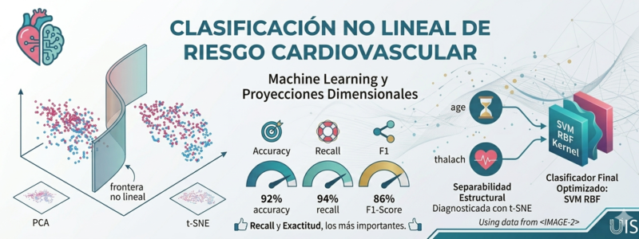

# Clasificación No Lineal de Riesgo Cardiovascular mediante Técnicas de Machine Learning y Proyecciones Dimensionales

  

## Autores
Wilmer Gómez - Dexy Sandoval

## Objetivo
Desarrollar un sistema predictivo de clasificación no lineal mediante Máquinas de Soporte Vectorial (SVM) y optimización de hiperparámetros para identificar el riesgo cardiovascular en pacientes, validando la separabilidad estructural mediante PCA y t-SNE.

## Dataset
* **Nombre:** Heart Disease Dataset (UCI Machine Learning Repository)
* **Descripción:** Conjunto de datos clínicos con 302 registros y 13 características médicas (edad, presión arterial, colesterol, frecuencia cardíaca máxima, entre otras) utilizado para diagnosticar la presencia o ausencia de enfermedades del corazón.
* **Link de descarga:** [UCI Heart Disease Dataset](https://archive.ics.uci.edu/dataset/45/heart+disease)

## Modelos
* **Análisis Exploratorio y Regresión:** Linear Regression, Ridge Regression, Decision Tree Regressor.
* **Reducción de Dimensionalidad:** Principal Component Analysis (PCA), t-Distributed Stochastic Neighbor Embedding (t-SNE).
* **Clasificación (Machine Learning):** Gaussian Naive Bayes (GNB), Decision Tree (DT), Random Forest (RF), Support Vector Machines (SVM con Kernel RBF).
* **Deep Learning:** Deep Neural Networks (DNN).

## Enlaces
* **Código Fuente:** [Enlace al Jupyter Notebook o scripts de código en este repositorio](https://colab.research.google.com/drive/1h6ClyUJ6AfMtLT29tU24q0QT7RbgtfD4)
* **Video de Sustentación:** [Ver Video Explicativo en YouTube](https://youtu.be/xRv-v7JJUfU)
* **Repositorio Oficial:** [Enlace al Repositorio GitHub](https://github.com/wilfergv9/risk-cardio-svm-pca)
